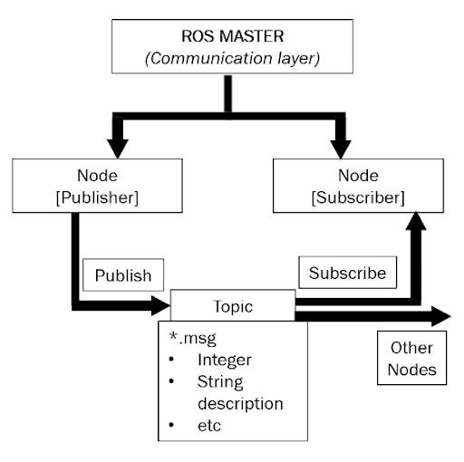

# ROS1

***Note:*** The projects simple pubsub and turtlesim I worked on while understanding ROS have been lost only the written data is preserved.

## Fundamentals

 <p align="center">
	
</p>

### General:
Workspace is the space where I work on my project.

Src (source file) is where projects are stored inside our workspace. Hence we can have multiple projects in our workspace.

Building a workspace is like setting up the workspace.
Build folder contains all the build information of projects.

Logs contain the records of the projects.

Devel contains the reference, setup things for development.

By importing rospy in a python library we mean that we will run ros in a python code

### Nodes:
Nodes perform specific tasks.
A node can be categorized as a publisher or a subscriber
User subscribes to the topic to get messages.
Publishers publish to topics a specific message which user views and utilizes them,
We usually create nodes to accomplish our robotic task
Details about a node can be found out by
```python
rosnode info /node_name
```
Usually the package we download contains various topics and we write subscriber codes for it.

### Topics:
Topic is basically a channel through which messages flow from publisher to subscriber
Topics are channels which receive msgs from publisher and passes on to subscribers
The messages published have only a specific data type
Commands:

```python
rostopic bw	display bandwidth used by topic
rostopic delay	display delay of topic from timestamp in header
rostopic echo	print messages to screen
rostopic find	find topics by type
rostopic hz	display publishing rate of topic    
rostopic info	print information about active topic
rostopic list	list active topics
rostopic pub	publish data to topic
rostopic type	print topic or field type
```

<br>

### ROS data types (messsages):
ROS can work only with certain data types only which can be found in:

```python
aditya@aditya-HP-Laptop-15-da0xxx:/opt/ros/noetic/share/std_msgs/$
```
All standard data types are included and some advances such as colorRGB, dimensional arrays, headers
As the message has a data type that needs to be included in the python file
Ros messages can be made up of using other ros messages or simple data type as well. The underlying part can be accessed by using dot operator, these are called as composite messages.
When defining in code we do

```python
Msg = Twist() or trajectory_msg = JointTrajectory()
```
To get info on message
```python
rosmsg info trajectory_msgs/JointTrajectory

std_msgs/Header header
  uint32 seq
  time stamp
  string frame_id
string[] joint_names
trajectory_msgs/JointTrajectoryPoint[] points
  float64[] positions
  float64[] velocities
  float64[] accelerations
  float64[] effort
  duration time_from_start
```
<br>

### Roscore:
Roscore is basically to used to start the ros master which initiates the other ros nodes and topics
Before running any ros code we need to run the roscore command to kinda start ros
Rosrun:
To run a node within a specific package, only nodes not launch files not services

```python
 rosrun pakage_name node_name
```
node_name is a python file

<br>

### Echo:
When we run a package using above command the packages runs no doubt but the message it should give to the subscriber is not reflected on the terminal because the terminal is not the subscriber to the publisher, to view the msg without subscribing to the publisher we use echo command

```python
rostopic echo/topic_name
```

<br>

### Roslaunch:
Roslauch allows to run multiple nodes simultaneously
Roslaunch also run the roscore for us
We can also run multiple copies of a single node dependent or independent of each other and rostopics using launch file

```python
Roslaunch package_name launch_file
```

<br>

### Keep in Mind:
Double tab to get info about available options for a command
Every time we create a new package the workspace needs to build again
To build the workspace we have to be inside the workspace
The catkin_make command only build package in src folder so if the package is outside the src folder we need tell it using 

```python
catkin_make --source my_src
rospack list 
```

To get list of all packages existing on the computer

```python
rospack list | grep package_name
```
To find the location of package

<br>

### Developing a node:
A callback function is called every time the publisher publishes any msg, kinda interrupts, we use this interrupt and the msg published by the publisher to interpret our things, and for the rest of time subscriber does nothing.

<br>

### ROSservices:
Services are a client-server system where a node requests for a specific services required not so frequently to the package
We can even use services offered by topics in our code
Commands:
```python
rosservice args	print service arguments
rosservice call	call the service with the provided args
rosservice find	find services by service type
rosservice info	print information about service
rosservice list	list active services
rosservice type	print service type
rosservice uri	print service ROSRPC uri

```

<br>

### Gazebo:
A simulation environment.
Defines how the world sees the robot.
How the world interacts with the robot.
Does require collision and inertial properties

<br>

### Rviz:
Used to visualize the structure of the robot
How the joints are defined in 3d space
When we launch rviz we can pass some **parameters** like which robot description to include, in case of gazebo we tell which world to load and which robot to load.
**Arguments** defined things like whether to pause the simulation at start up or not, basically modifying the platform software so as to fit our needs.

<br>

### Transforms:
Relation between joints of a robot

Change in the parent link is reflected by the child link due to joints represented by **robot state publishers**. But in this there is no relative motion between the parent and child. Eg head and 

eyes
But when there is relative motion between any two links the state of the child needs to be defined by the amount of joint rotated/ moved which is defined by the **joint state publisher**.

**ROS Controllers** are used to control the position of a joint, basically controllers act as motors in real life.

**Position controllers** set the position of joint, it directly set the position without giving a feel of motion to us, instantaneously changes the position to the required position
**Effort and velocity controllers** are little of the same where they traverse all the points between the motion from a point to another hence we get a smooth motion when these controllers are used. We also provide the torque and force that needs to applied on the joint
In velocity control we provide the velocity the joint should move
**Joint trajectory controller** provide the path/ trajectory for the movement e.g if angle is too be changed from 0 to 20, there might be linear change from 0 to 10 but a logarithmic change from 
10 to 20

**Transmissions** are like the interface between the controller and the joint, usually defined in urdf1

<br>

### Callback function:
The callback is called every time data is published on the topic that the node has subscribed to.
But if want to recive the message only once or a limited number of times then we can use 
```
robotPose = rospy.wait_for_message('/odom', Odometry)
```

The functions waits until a message is published on the topic and once published it is returned to the specified variable.

---

## Turtlesim
 <p align="center">
	
</p>
**Flow chart of turtlebot**

In turtlesim we have 3 topics:
```
cmd_vel, color_sensor, pose
```
When turtlesim is fired, there are currently no publishers to publish to these topics hence the turtle does not move.
Also the window on which the turtle bot is visible has subscribes to the topics
When we run 

```
rosrun turtlesim turtlesim_node
```

This node publishes to pose and displays the position of robot.
So basically the terminal takes data from cmd_vel calculates the position displays it and send to pose topic.
We can even create packages to publish and subscribe to topics created in other packages
In turtlesim the cmd_vel topic has no publisher by default but has a subscriber which is the terminal itself
We as a user set the velocity of the bot using cmd_vel and hence we as a user publish to it
But the pose topic has no subscriber but has a publisher that implies the pose is generally received as a feedback to get the position of the turtle bot, turtlesim itself publishes the command to the topic which depend on cmd_vel and then we can use it as a feedback

Currently only proportional control system is used cause the bot bot just perfect with that, had no need to add differential and integral control system
Current system contains only a single node which does all - PID, driving, initial setup.
Maybe further development will be to create separate nodes for separate functions

---

## [Robotic Arm](https://github.com/maker-ATOM/SPARK-A-4DOF-ROS-ROBOTIC-ARM)

Joints:
Things which connect links, give motion to the system.

Links:
Rigid bodies with relative motion between them to perform a specific task.

Trajectory generation:
When we want to move from one point to another we divide the path into multiple points with equal or unequal spacing between them, this is called trajectory generation.

The intermediate points are known as way points.

Motion planning is basically trajectory planning avoiding all objects in between them.

---

## SLAM
SLAM stands for simultaneous localization and mapping.
Usually done when there are chances that the map can be changed wrt time.

### Sensor data

### Sensor Fusion
 
### Localization
Localization is process of finding where you as a robot is currently present in a map given to you.
Localisation uses algorithms like particle filters to find ther robots location in the given map.
In localization the map given is static that is it does not change wrt time.

### Mapping

Gmappping is map generation tool which uses other libraries like openslam 

### Path planning
### Navigation
### Motion Planning
### Control System 

---

## Resources:

- [Why do I think you should build this robot?](https://www.youtube.com/watch?v=OWeLUSzxMsw&list=PLunhqkrRNRhYAffV8JDiFOatQXuU-NnxT)

- [ROS Custom Python Nodes Deep Dive](https://www.youtube.com/watch?v=otGWUZqB9XE&list=PLBbhfIdh4NdgBBkX7q0Y3UukO2_ZoICee&index=4)

- [Gazebo in 5 mins 001 - How To Launch Your First Gazebo World Using ROS](https://www.youtube.com/watch?v=qi2A32WgRqI&list=PLK0b4e05LnzbHiGDGTgE_FIWpOCvndtYx&index=1)

- [ROS Tutorials for Beginners | ROS 101: Fun Approach | Introduction](https://www.youtube.com/watch?v=aglMwwBlMXU&list=PLlqdnFs9xNwql5KET7v7zyl393y10qxtw&index=11)

- [Autonomous Navigation](https://www.youtube.com/playlist?list=PLn8PRpmsu08rLRGrnF-S6TyGrmcA2X7kg) - YouTube


